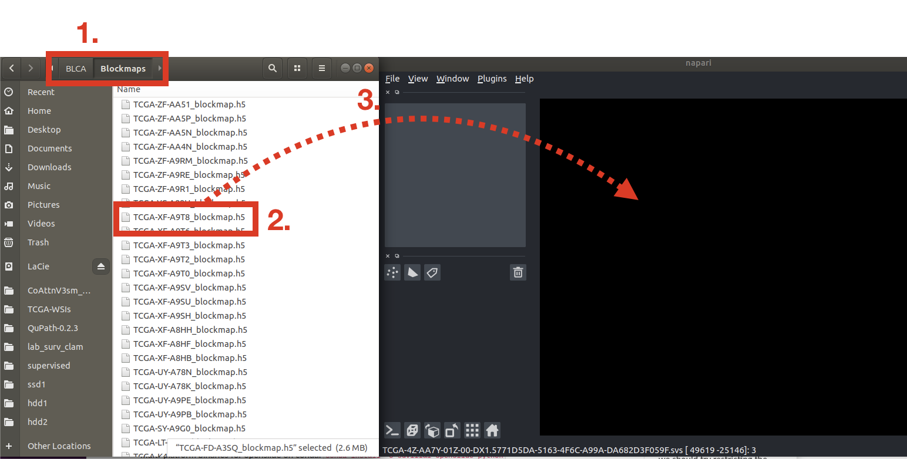
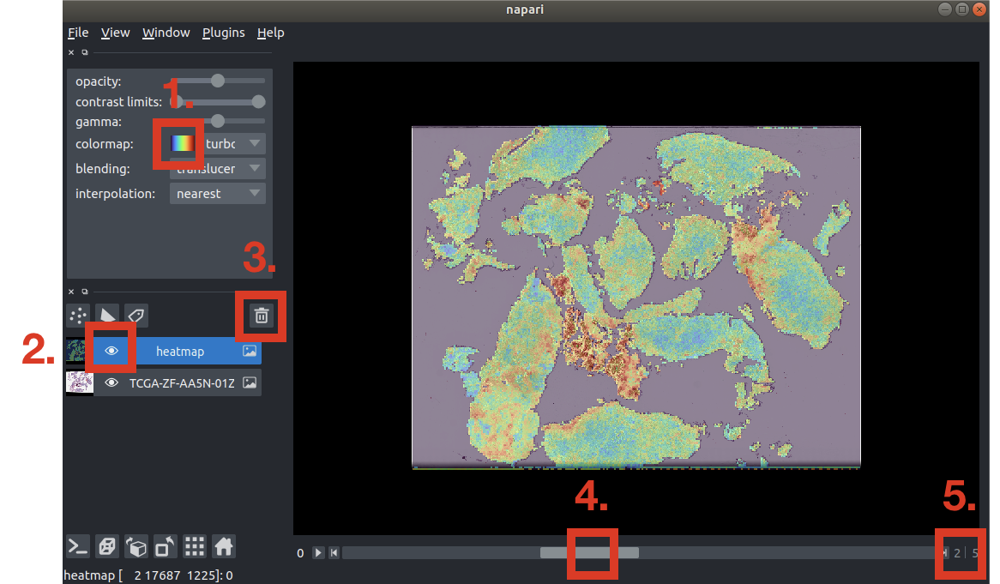

# patch-viewer (Napari)

🐧 WIP

### 1. Anaconda
Install [Anaconda](https://www.anaconda.com/products/individual) for your operating system (Choosing the Graphical or Command Line Installer depends on your preference).

### 2. Install MacOS System Dependencies (Brew + OpenSlide)
Brew is a Package Manager for MacOS that can be installed with these [instructions](https://brew.sh/). To install, open Terminal and copy+paste:
```bash
$ /bin/bash -c "$(curl -fsSL https://raw.githubusercontent.com/Homebrew/install/HEAD/install.sh)"
```
Once Brew is installed, you can install OpenSlide via:
```bash
$ brew install openslide
```

### 3. Install Python Dependencies for Napari
```bash
$ conda create -n patch-viewer python=3.9
$ conda activate patch-viewer
$ pip install "napari[all]" # install napari
$ pip install git+git://github.com/manzt/patch-viewer.git # install this package from github
```

### 4. Napari Usage
To Open Napari:
```bash
$ napari # opens viewer, can drag and drop files
# or 
$ napari path/to/my_blockmap.h5 # automatically loads view for file
```
Each dataset folder contains: 1) a **Raw_HE** folder containing the raw H&E images, 2) **Blockmaps** folder containing the heatmaps. To open a heatmap,
1. Go to the **Blockmaps** directory
2. Find the **.h5** file you are interested in visualizing
3. Drag-and-drop the **.h5** file to Napari


Below is a walkthrough on the UI of Napari:
1. Selects the desired colormap. "turbo" is set as the default.
2. Similar to Adobe Photoshop, images are opened as masks. To switch between H&E and the heatmaps, click on the "hide" button to deselect vieweing the heatmap mask.
3. Before opening another **.h5** file, delete the currently opened masks.
4. Slider bar to switch between the co-attention heatmaps.
5. Counter on the current heatmap you are viewing.


Co-Attention Heatmap Signature Names:

0. Tumor Supressor Genes
1. Oncogenes
2. Protein Kinases
3. Cell Differentiation Markers
4. Transcription Factors
5. Cyokines and Growth Factors
